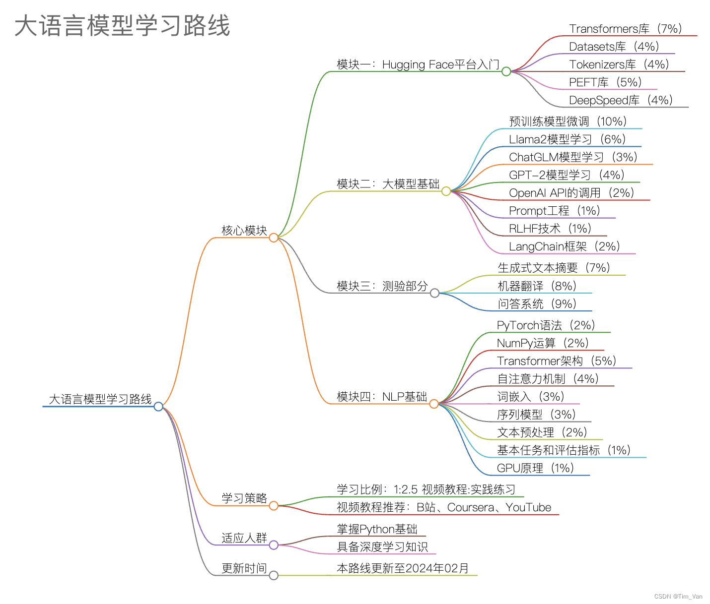

# 大语言模型学习路线：从入门到实战

在人工智能领域，大语言模型（Large Language Models, LLMs）正迅速成为一个热点话题。

本学习路线更新至2024年02月，后期部分内容或工具可能需要更新。

### 适应人群

已掌握Python基础
具备基本的深度学习知识

### 学习步骤

本路线将通过四个核心模块进行学习，如果希望打基础可以优先学习模块四：NLP基础
学习比例遵循1:2.5的规则，即每观看一部分视频内容后，应至少投入2.5倍的时间进行实践练习。
百分号表示学习内容的比例，如“Transformers库（7%）”表示该部分内容占整个学习路线的7%。

### 模块四：NLP基础

PyTorch语法（2%）
NumPy运算（2%）
Transformer架构（5%）
自注意力机制（4%）
词嵌入（3%）：理解词嵌入（Word Embedding）的概念和方法，如Word2Vec、GloVe。
序列模型（3%）：学习RNN、LSTM、GRU等序列模型的原理和应用
文本预处理（2%）：掌握NLP处理的基础技术。
基本任务和评估指标1%）：了解NLP的基本任务（如命名实体识别、依存句法分析）和相应的评估指标。
深度学习中的GPU原理（1%）：并行计算、CUDA编程等
建议视频教程：Coursera上的“NLP专项课程”或B站的“PyTorch教程”。

### 模块一：Hugging Face平台入门

Transformers库（7%）：理解如何使用Transformers进行模型的加载和预测。
Datasets库（4%）：学习如何处理数据
Tokenizers库（4%）：学习如何进行有效的文本分词。
PEFT库（5%）：掌握模型训练和加速的高级技术。
DeepSpeed库（4%）：模型加速训练的底层技术。
建议视频教程：搜索“Hugging Face教程”在B站或Coursera上找到相应的课程。

### 模块二：大模型基础

预训练模型微调（10%）：学习如何根据自己的数据集微调模型。
Llama2模型学习（6%）：特别是分词器、输入输出具体格式、模型结构
ChatGLM模型学习（3%）
GPT-2模型学习（4%）
OpenAI API的调用（2%）：学习如何使用常见的大语言模型接口。
Prompt工程（1%）：学习模型的使用技巧。
RLHF技术（1%）：学习高级模型训练技术。
LangChain框架（2%）：学习如何使用LangChain进行模型开发
建议视频教程：在YouTube或B站搜索模型名称加“教程”关键词。

### 模块三：测验部分

通过实际项目测试所学知识。

生成式文本摘要（7%）：利用大模型生成文章或报告的摘要
机器翻译（8%）：使用大模型完成一种语言到另一种语言的文本翻译任务，了解BLEU评分等
问答系统（9%）：利用大模型和知识库，构建单轮或多轮问答系统
学习建议：当感到学习疲累时，尝试完成这一部分的实践项目，以检验和巩固学习成果。可以在Kaggle上找到相应的比赛项目。

参考内容
大模型学习路线记录：https://zhuanlan.zhihu.com/p/663556778

大语言模型（LLM）学习路径和资料汇总：https://github.com/ninehills/blog/issues/97

大模型学习路线与建议：https://cloud.tencent.com/developer/article/2344193
